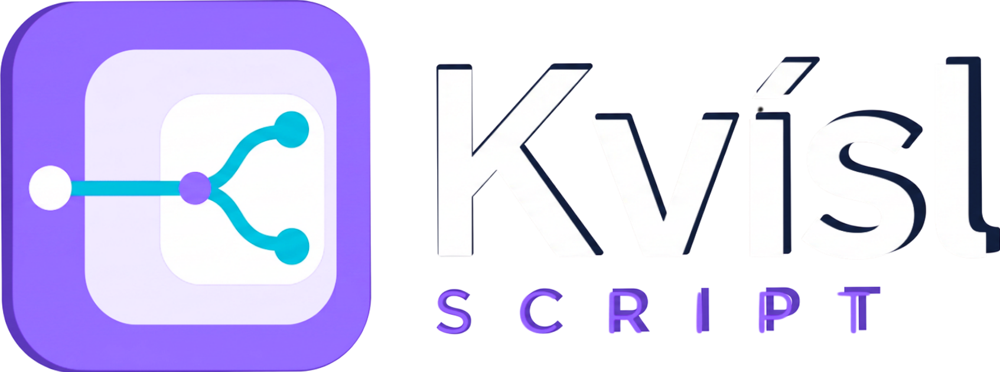
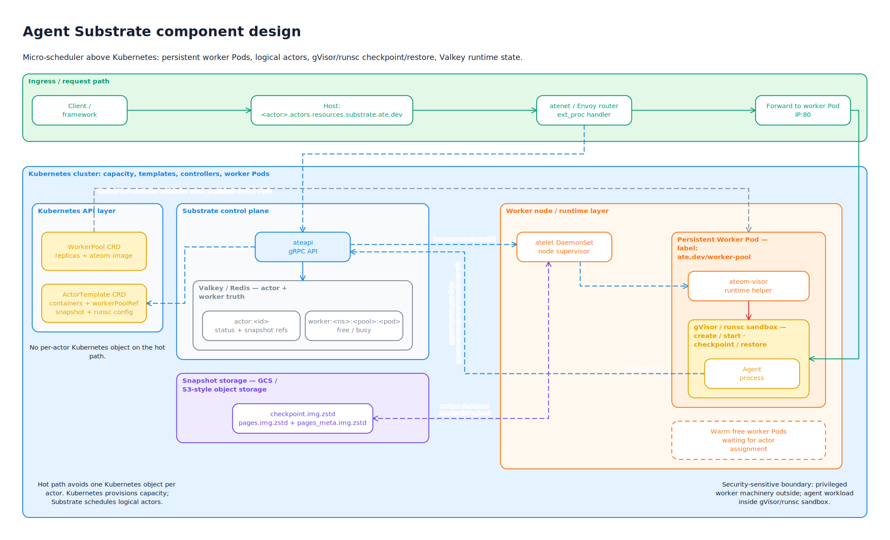
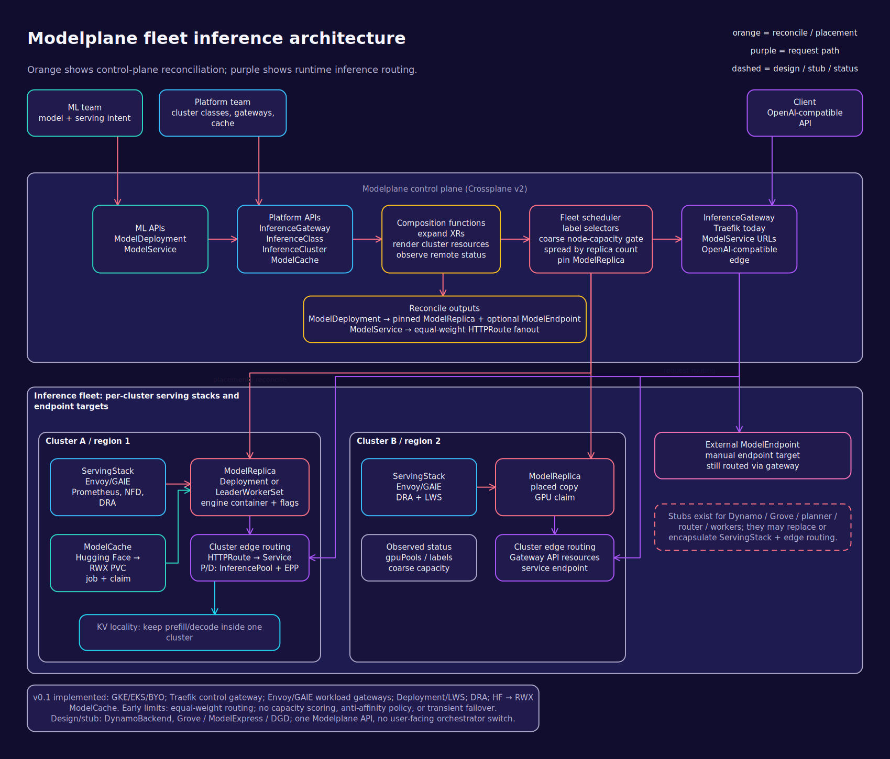

> **Experimental prototype — language design, documentation, and layouter**

<p align="center">
  
</p>

# Kvísl Script

Kvísl Script, or Kvísl for short, is a composable modelling language for architecture diagrams. It is designed for agents to understand, edit, and evolve those diagrams over many iterations without accumulating hand-maintained coordinates or routing geometry. It aims to scale from a small sketch to an effectively unbounded system canvas while keeping logical structure — not pixel coordinates — as the source of truth.

The long-term target is a model detailed enough to describe a complete distributed Kubernetes system in full detail or an entire Linux kernel, from the highest architectural boundaries down to the lowest useful implementation level. A DIN A0 poster is a normal output size, not the limit of the model.

## Flagship example

[](examples/agent-substrate/diagram.tsx)

The [Agent Substrate model](examples/agent-substrate/diagram.tsx) is the kind of architecture diagram Kvísl is built to create: visually rich, deeply nested, and crossed by connections that do not flatten its hierarchy. Its source describes components, containment, ports, layout intent, and meaningful routing regions rather than drawing coordinates. An agent can expand, restructure, and refine it over many iterations while Kvísl recomputes the concrete layout and routes.

## Why

Large technical drawings usually fail in one of two ways: a diagram language supports only a narrow family of charts, or a drawing tool leaves authors maintaining positions and routes manually. Both approaches become fragile as a system grows.

Kvísl instead treats a drawing as a composable logical model:

- components expose public ports while retaining optional deep hierarchical addressing;
- every ordinary structural container has a local ID and contributes to its containment path;
- scopes provide containment, local identity, and local orientation;
- layouts express relationships rather than coordinates;
- lines cross arbitrary hierarchy boundaries;
- most route segments are inferred;
- explicit segments pin only the semantically important parts of a route;
- whitespace created by layout is also the routing plane;
- presentation comes from typed rules in a layered cascade — renderer, theme, library, document, inline — keyed by roles and classes;
- components can provide several context- and detail-sensitive views, selected media-query-style;
- one model can support overview, detailed, poster, tiled, and infinite-canvas rendering.

## Core principles

### Composition first

Components are ordinary TypeScript functions. Callers normally attach lines through opaque port handles and do not depend on component-internal IDs. When intentional deep access is useful, every named container remains reachable through a relative hierarchical path. Components can be nested, repeated, moved, and expanded or collapsed without rewriting their internal connections.

### One model across all scales

High-level architecture and low-level implementation detail coexist in the same logical graph. A component may provide named meta views for a symbol, summary, specialized projection, or detailed internals. Unselected view templates are invisible to normal paths and do not create active objects or a second component identity.

View selection works like media and container queries against a renderer-created context; the exact semantics live in [REQUIREMENTS.md](REQUIREMENTS.md) section 7.4.

### No coordinate authoring

Authors describe containment, layout, ports, lines, constraints, and routing regions. Layout and routing cooperate to reserve space. Absolute positions are not part of the normal authoring model.

### Whitespace is routable structure

Margins, padding bands, and gaps between layout siblings form implicit routing regions. Named corridors refine those regions with spacing, pressure, ordering, or a visible divider.

<p align="center">
  <a href="docs/diagrams/routing-corridors.tsx">
    
  </a>
</p>

The translucent red cells are the local renderer's debug view of the same canonical corridor mesh used for routing. They are generated from the linked Kvísl source, not painted as documentation artwork.

### Renderer-neutral pipeline

TSX is evaluated once and normalized into a versioned, language-neutral Logical IR. Independent TypeScript, Go, and Rust solvers or renderers can consume that IR.

```text
diagram.tsx
    -> TSX evaluation and component expansion
    -> Logical IR
    -> renderer context, first-fit view selection, and meta-branch materialization
    -> Projection IR
    -> layout and routing
    -> Solved IR
    -> Excalidraw, SVG, Canvas, or another painter
```

<p align="center">
  <a href="docs/diagrams/render-pipeline.tsx">
    
  </a>
</p>

## CSS

Kvísl separates structure from presentation through CSS-style tokens and typed rules. Selectors match stable entity kinds, roles, classes, shapes, and IDs; the cascade may change paint and metric defaults, but it cannot change objects, ports, lines, routing intent, layout strategy, or identity.

The rendering below uses the exact same [`ModelplaneFleetInferenceDiagram`](examples/modelplane-fleet-inference/diagram.tsx) component as the reference fixture. The alternate entry supplies only the [`neonInfrastructureTheme`](examples/modelplane-fleet-inference/neon-infrastructure-theme.ts): no object, port, line, segment, corridor, constraint, or layout declaration is duplicated. A regression test asserts that every solved object box, route, and label position is identical between both renders.

```tsx
import { ModelplaneFleetInferenceDiagram } from "./diagram";
import { neonInfrastructureTheme } from "./neon-infrastructure-theme";

export default (
  <ModelplaneFleetInferenceDiagram styles={neonInfrastructureTheme} />
);
```

<p align="center">
  <a href="examples/modelplane-fleet-inference/neon-infrastructure.tsx">
    
  </a>
</p>

Regenerate this rendering together with every other repository diagram using `npm run build`. The stylesheet remains typed TS data because the core contract is `RuleIR` and `TokenSetIR`; a standalone text stylesheet syntax is intentionally not required by the model.

## Authoring

Composition looks like this:

```tsx
type ServiceProps = {
  id: string;
  request: PortHandle<Request>;
};

function Service({ id, request }: ServiceProps) {
  return (
    <Scope id={id}>
      <Port id="request" side="left" bind={request} />

      {/* declaration order is preference order: first viable view wins */}
      <View
        id="internals"
        detail={2}
        requires={gte(context("allocation.inlineSize"), 70)}
        footprint={{ minWidth: 90, minHeight: 60 }}
      >
        <Column id="internal-layout">
          <Node id="api">API</Node>
          <Scope id="workers">{/* detailed render branch */}</Scope>
        </Column>
        <PortPlacement port="request" on="internal-layout/api" side="left" />
      </View>

      <View id="summary" detail={0} footprint={{ minWidth: 30, minHeight: 15 }}>
        <Node id="card">Service</Node>
        <PortPlacement port="request" on="card" side="left" />
      </View>
    </Scope>
  );
}

const clientRequest = port<Request>();
const serviceRequest = port<Request>();

export default (
  <Diagram id="service-system">
    <Row id="services">
      <Scope id="client">
        <Node id="ui">
          <Port id="request" side="right" bind={clientRequest} />
        </Node>
      </Scope>

      <Service id="service" request={serviceRequest} />
    </Row>

    <Line from={clientRequest} to={serviceRequest}>
      <Segment
        through={gap("services/client", "services/service")}
        label="request"
      />
    </Line>
  </Diagram>
);
```

The component caller knows only the public port handle. The normalizer resolves both handles to stable ports and infers hierarchy traversal. `services/service/internals` and `services/service/workers` do not enter the hidden view templates. Renderer materialization creates the selected branch in Projection IR.

A named endpoint such as `services/client/ui.health` implicitly defines `health` on the ordinary `ui` object if necessary. A nested `<Port id="health">` or later `<Port ref="services/client/ui.health" marker="circle">` configures that same canonical port rather than creating another one. Lines attached to the same named port form one join and follow the sharing policy declared there.

An endpoint that names only an object, such as `services/client/ui`, creates a distinct dock owned by that line end. It does not create a port or join with another object-only endpoint. Dock and line styles both contribute to the rendered attachment: non-conflicting properties compose, while the line style overrides any property also supplied by the dock.

A normal deep line target stops at the deepest object instantiated by the selected views. If a line truly needs a different target for one rendered view, endpoint alternatives provide the explicit escape hatch through a typed `alt()` helper: it chooses `abc` when `foo` renders view `view`, otherwise `foo/bar`. A compact string spelling may exist as sugar, but the structured helper is normative, and normal paths never expose the meta tree.

## Documentation

- [Overview](docs/overview.md) explains the model and where Kvísl fits.
- [Getting started](docs/getting-started.md) creates and renders a TSX model as an editable Excalidraw document.
- [Routing, corridors, and ports](docs/routing-and-ports.md) illustrates hierarchy-crossing routes, sharing modes, port groups, and docks.
- [UML with Kvísl Script](docs/uml.md) covers the UML library and its normalization to the core model.
- [Documentation index](docs/README.md) links the complete guide set.

The language and implementation contracts are documented separately:

- [DESIGN.md](DESIGN.md) describes implementation architecture and plumbing only.
- [REQUIREMENTS.md](REQUIREMENTS.md) states the normative language and system requirements.
- [MODEL.md](MODEL.md) defines the conceptual data model and draft Logical IR.
- [`examples/`](examples/) contains complete architecture and UML models.

A grammar change must update every affected fixture so the language stays tested against real design drawings rather than toy flowcharts.

### Dogfooding the documentation

The architecture, feature, UML, debug-routing, and alternate-style graphics linked from the README and guides are rendered from repository TSX with the local evaluator, layouter, router, and SVG painter. Their sources live in [`docs/diagrams/`](docs/diagrams/) and [`examples/`](examples/); generated documentation assets live in [`docs/generated/`](docs/generated/), and the complete example gallery lives in [`experiments/layouter/output/`](experiments/layouter/output/).

```console
npm run build
```

That one command regenerates normal and routing-debug example galleries, documentation diagrams, and the alternate CSS render. Original drawings under `examples/` remain visual acceptance references and are deliberately never overwritten.

## Reference fixtures

Each fixture contains the original drawing and the TSX model intended to reproduce it:

- [Vegvísir voice agents](examples/vegvisir-voice-agents/diagram.tsx)
- [Modelplane fleet inference](examples/modelplane-fleet-inference/diagram.tsx)
- [Agent Substrate](examples/agent-substrate/diagram.tsx)
- [Machine thought operating system](examples/machine-thought-os/diagram.tsx)

The references exercise nested containment, repeated components, long hierarchy-crossing routes, shared trunks, fan-out and fan-in, routing corridors, annotations, boundaries, and mixed levels of detail.

## UML examples

[`examples/uml/`](examples/uml/) contains complete TSX formulations for class, object, component, deployment, package, use-case, sequence, activity, and state-machine diagrams.

The UML vocabulary is expressed as an ordinary TSX component library over the core model. UML diagram types therefore do not become privileged syntax or renderer-specific IR variants.

## Non-goals

Kvísl is not:

- a new general-purpose programming language;
- a fixed collection of diagram types;
- a pixel-coordinate drawing format;
- tied to Excalidraw as its only renderer;
- expected to reconstruct the original TSX source from normalized IR.
