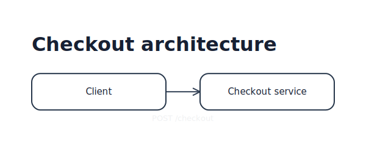
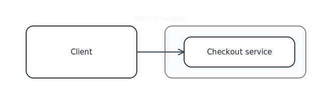
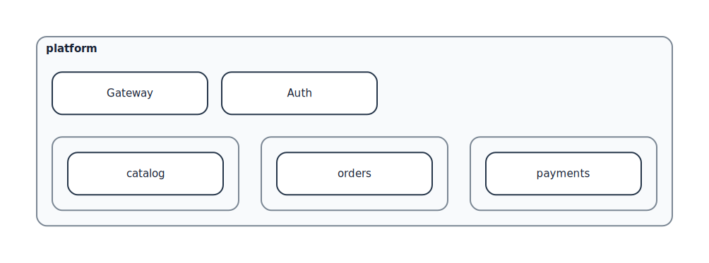

# Generated documentation diagrams

> Generated by `npm run build` from the TSX sources in [`docs/diagrams/`](../diagrams/). Do not edit these SVGs by hand.

The normal and routing-debug variants use the same local evaluator, layout engine, router, and SVG painter as the repository examples.

<table>
  <tr><th>Kvísl source</th><th>Generated SVG</th></tr>
  <tr>
    <td><a href="../diagrams/getting-started-first.tsx"><code>getting-started-first.tsx</code></a></td>
    <td></td>
  </tr>
  <tr>
    <td><a href="../diagrams/getting-started-reusable.tsx"><code>getting-started-reusable.tsx</code></a></td>
    <td></td>
  </tr>
  <tr>
    <td><a href="../diagrams/getting-started-layout.tsx"><code>getting-started-layout.tsx</code></a></td>
    <td></td>
  </tr>
  <tr>
    <td><a href="../diagrams/getting-started-route-auto.tsx"><code>getting-started-route-auto.tsx</code></a></td>
    <td></td>
  </tr>
  <tr>
    <td><a href="../diagrams/getting-started-route-segment.tsx"><code>getting-started-route-segment.tsx</code></a></td>
    <td></td>
  </tr>
  <tr>
    <td><a href="../diagrams/getting-started-private-dock.tsx"><code>getting-started-private-dock.tsx</code></a></td>
    <td></td>
  </tr>
  <tr>
    <td><a href="../diagrams/getting-started-styling.tsx"><code>getting-started-styling.tsx</code></a></td>
    <td></td>
  </tr>
  <tr>
    <td><a href="../diagrams/getting-started-orientation-depth.tsx"><code>getting-started-orientation-depth.tsx</code></a></td>
    <td></td>
  </tr>
  <tr>
    <td><a href="../diagrams/routing-corridors.tsx"><code>routing-corridors.tsx</code></a></td>
    <td></td>
  </tr>
  <tr>
    <td><a href="../diagrams/routing-corridors.tsx"><code>routing-corridors.tsx</code></a></td>
    <td></td>
  </tr>
  <tr>
    <td><a href="../diagrams/port-sharing.tsx"><code>port-sharing.tsx</code></a></td>
    <td></td>
  </tr>
  <tr>
    <td><a href="../diagrams/port-sharing.tsx"><code>port-sharing.tsx</code></a></td>
    <td></td>
  </tr>
  <tr>
    <td><a href="../diagrams/port-groups.tsx"><code>port-groups.tsx</code></a></td>
    <td></td>
  </tr>
  <tr>
    <td><a href="../diagrams/port-groups.tsx"><code>port-groups.tsx</code></a></td>
    <td></td>
  </tr>
  <tr>
    <td><a href="../diagrams/adaptive-service.tsx"><code>adaptive-service.tsx</code></a></td>
    <td></td>
  </tr>
  <tr>
    <td><a href="../diagrams/adaptive-service.tsx"><code>adaptive-service.tsx</code></a></td>
    <td></td>
  </tr>
  <tr>
    <td><a href="../diagrams/orientation.tsx"><code>orientation.tsx</code></a></td>
    <td></td>
  </tr>
  <tr>
    <td><a href="../diagrams/render-pipeline.tsx"><code>render-pipeline.tsx</code></a></td>
    <td></td>
  </tr>
</table>
