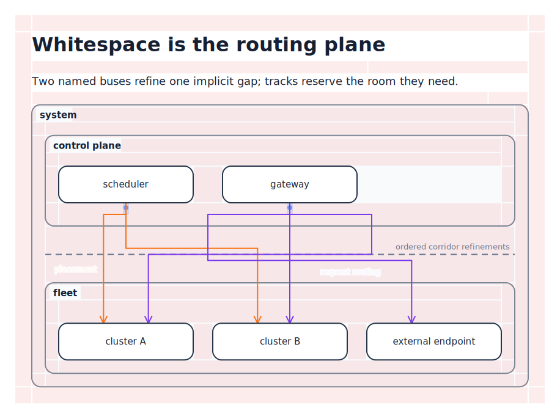
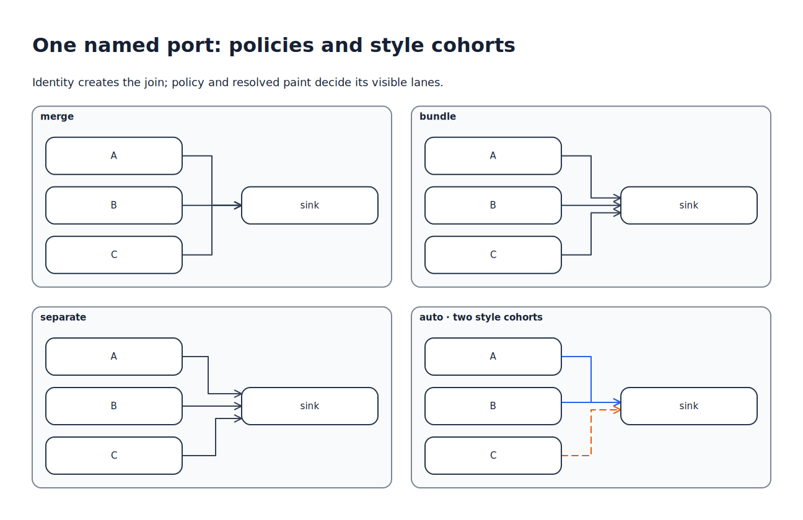
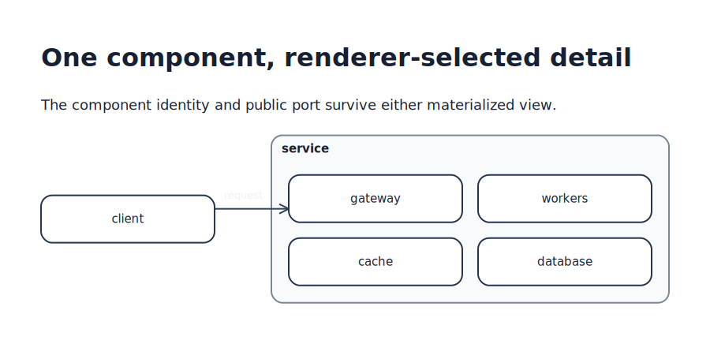
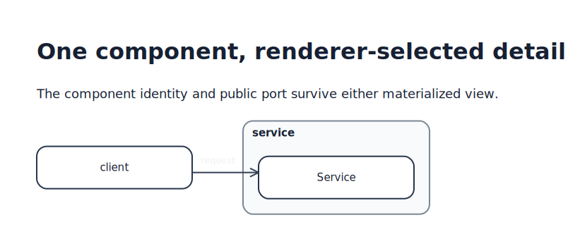
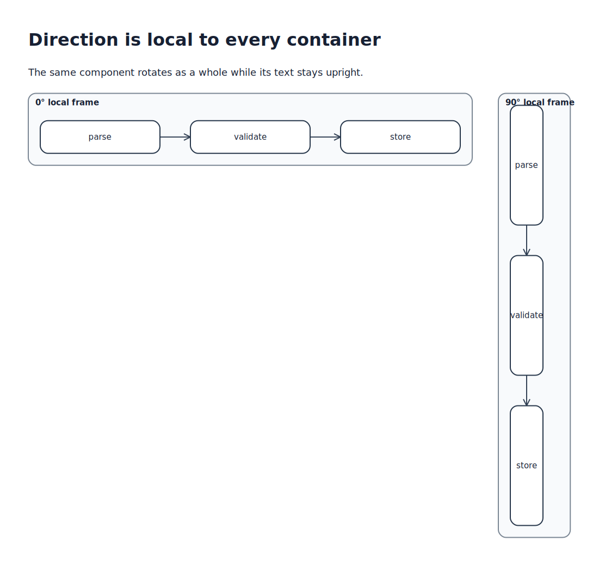
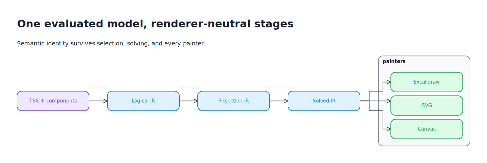

# Getting started

This guide walks from an empty TSX file to an editable Excalidraw document, then introduces reusable components, logical routing, presentation rules, and adaptive views. A supported Node.js installation with npm and `npx` is the only system prerequisite; the [dependency guide](dependencies.md) covers reusable local and Internet modules.

## Create the first diagram

Create `architecture.tsx`:

```tsx
import {
  Diagram,
  Line,
  Node,
  Port,
  Row,
  Text,
  Title,
} from "@kvisl/core";

export default (
  <Diagram id="hello-kvisl" theme="excalidraw-handdrawn">
    <Title>Checkout architecture</Title>

    <Row id="system" gap="large">
      <Node id="client">
        <Text>Client</Text>
        <Port id="request" side="right" />
      </Node>

      <Node id="service">
        <Text>Checkout service</Text>
        <Port id="request" side="left" />
      </Node>
    </Row>

    <Line
      id="checkout-request"
      from="system/client.request"
      to="system/service.request"
      label="POST /checkout"
    />
  </Diagram>
);
```

Render it:

```console
$ npx kvisl render architecture.tsx -o architecture.excalidraw
📦 Resolving dependencies
⚡ Transforming TSX
🧩 Expanding components
🧱 Normalizing the model
🔭 Selecting views
📐 Laying out objects
🛤️ Routing lines
🎨 Painting Excalidraw
✨ Wrote architecture.excalidraw
```

The command evaluates the TSX module, expands components, normalizes the logical model, lays it out, routes the line, and writes an editable Excalidraw document. Human-facing progress is colorful and every step begins with an emoji; structured diagnostic modes omit that decoration.

The important absence in the source is intentional: there are no x/y positions, line bends, or label coordinates.

## Understand IDs and paths

IDs are local to their containing object. The path `system/client.request` means:

1. enter the `system` layout container;
2. select its child `client`;
3. select the `request` port owned by that object.

`/` descends through named containers, `..` ascends, and `.` selects a port. A component can use the same internal IDs every time it is instantiated because each component root creates a new namespace.

References are resolved after component expansion and normalize to entity keys. Ordinary lookup never enters an unmaterialized view branch.

## Extract a reusable component

The direct path above couples the caller to `service.request`. A reusable component should expose a port handle instead.

```tsx
type Request = { path: string };

type ServiceProps = {
  id: string;
  request: PortHandle<Request>;
};

function Service({ id, request }: ServiceProps) {
  return (
    <Scope id={id} role="service">
      <Node id="api">
        <Text>Checkout service</Text>
        <Port id="request" side="left" bind={request} />
      </Node>
    </Scope>
  );
}

const checkoutRequest = port<Request>();

export default (
  <Diagram id="checkout" theme="excalidraw-handdrawn">
    <Row id="system" gap="large">
      <Node id="client">
        <Text>Client</Text>
        <Port id="request" side="right" />
      </Node>

      <Service id="checkout-service" request={checkoutRequest} />
    </Row>

    <Line
      from="system/client.request"
      to={checkoutRequest}
      label="POST /checkout"
    />
  </Diagram>
);
```

The caller now knows only the component ID and public handle. `Service` can insert scopes, change layouts, or forward the handle to a child component without changing the line.

Port handles are authoring-time composition values. They resolve to canonical named ports before Logical IR is emitted; later planning, solving, and painting stages never need to understand authoring-time TypeScript handles.

## Describe layout intent

Layouts compose recursively:

```tsx
<Scope id="platform" layout={{ kind: "column", gap: "large" }}>
  <Row id="edge" gap="medium" align="center">
    <Node id="gateway">Gateway</Node>
    <Node id="auth">Auth</Node>
  </Row>

  <Grid id="services" columns={3} gap="large" order="prefer-source">
    <Service id="catalog" request={catalogRequest} />
    <Service id="orders" request={ordersRequest} />
    <Service id="payments" request={paymentsRequest} />
  </Grid>
</Scope>
```

`prefer-source` preserves source order when it remains a good solution but permits the solver to improve crossings or space usage. `fixed` makes the order a hard requirement; `free` removes the preference.

Alignment, distribution, intrinsic sizing, minimum sizes, and constraints refine the layout without introducing authored positions.

## Route through meaningful whitespace

With no explicit segments, a line is fully automatic:

```tsx
<Line from={clientRequest} to={ordersRequest} />
```

Add a segment only when a particular part of the route carries meaning:

```tsx
<Line from={clientRequest} to={ordersRequest}>
  <Segment
    through={gap("system/client", "system/orders")}
    label="validated request"
  />
</Line>
```

The segment requests a run through the whitespace between two layout siblings. The router still chooses its bends and docking geometry. Because lines reserve space by default, the gap expands if the label and route tracks need more room.

[](diagrams/routing-corridors.tsx)

A named corridor can refine a gap or padding band with ordering, capacity, spacing, pressure, allowed sharing, or a labeled divider. A route may also use `padding(container, side)` directly; inside a reusable component, `padding(self, "left")` refers to the component's own root without knowing its external ID.

## Join, merge, and branch lines

Lines attached to the same named port form one topological join. The port decides how their adjacent paths may share geometry:

```tsx
<Port
  id="events"
  side="right"
  cardinality="many"
  sharing={{
    mode: "merge",
    branch: { preference: "late" },
  }}
/>
```

`merge` draws a common trunk, `bundle` keeps close parallel strokes, `separate` splits immediately after the common dock, and `auto` leaves the choice to the router. Branching is as late as possible by default and may be constrained to a corridor or gap.

[](diagrams/port-sharing.tsx)

An endpoint that names only an object, rather than a port, gets a private line-owned dock:

```tsx
<Line from="client" to="service" />
```

Two such endpoints do not join accidentally even if the router places them at the same point. Name a port when shared attachment identity matters.

Port groups coordinate several distinct named ports. Their `merge`, `bundle`, `free`, and `separate` affinities are illustrated in [Routing, corridors, and ports](routing-and-ports.md#port-groups-are-not-named-port-joins).

## Separate structure from presentation

Give objects and lines roles or classes, then style them with typed rules:

```tsx
rule(role("service"), {
  fill: "near-white",
  stroke: "platform-blue",
});

rule(cls("request"), {
  stroke: "request-purple",
  strokeWidth: 2,
});
```

The cascade is fixed and predictable:

```text
renderer default < theme < library < document < inline style
```

Rules can set paint properties and metric defaults such as padding or minimum size. They cannot create objects, change ports, alter sharing, or hide topology. Structural variation belongs to views and conditions.

## Give a component multiple views

A component can preserve one identity while rendering a detailed or compact template:

```tsx
function Service({ id, request }: ServiceProps) {
  return (
    <Scope id={id} role="service">
      <Port id="request" side="left" bind={request} />

      <View
        id="internals"
        detail={2}
        footprint={{ minWidth: 90, minHeight: 60 }}
      >
        <Column id="internal-layout" gap="medium">
          <Node id="api">API</Node>
          <Node id="worker">Worker</Node>
        </Column>
        <PortPlacement
          port="request"
          on="internal-layout/api"
          side="left"
        />
      </View>

      <View
        id="summary"
        detail={0}
        footprint={{ minWidth: 30, minHeight: 15 }}
      >
        <Node id="card">Service</Node>
        <PortPlacement port="request" on="card" side="left" />
      </View>
    </Scope>
  );
}
```

Views are hidden meta branches. Declaration order is preference order, and the renderer chooses the first view whose requirement, footprint, and policy are viable. The unconditional summary is the final fallback.

`PortPlacement` maps the same canonical `request` port onto an anchor in each template. External lines stay attached while the rendered internals change.

<table>
  <tr><th>Detailed view selected for a wide allocation</th><th>Summary selected for a narrow allocation</th></tr>
  <tr>
    <td><a href="diagrams/adaptive-service.tsx"></a></td>
    <td><a href="diagrams/adaptive-service.tsx"></a></td>
  </tr>
</table>

Render for a constrained page:

```console
$ npx kvisl render architecture.tsx \
    --target a4 \
    --policy maximum-that-fits \
    -o architecture-a4.excalidraw
```

Render the same model for a large poster:

```console
$ npx kvisl render architecture.tsx \
    --target a0 \
    --policy maximum-that-fits \
    -o architecture-a0.excalidraw
```

The renderer allocates space outside-in and may select different views without re-evaluating the TSX or changing semantic identity.

## Rotate a local frame

Every container interprets directions in its local frame:

```tsx
<Scope id="vertical-stack" orientation={90}>
  <Row id="pipeline">
    <Node id="parse" />
    <Node id="validate" />
    <Node id="store" />
  </Row>
</Scope>
```

The local row becomes a physical column. Local left/right ports, corridors, and routes rotate with it; text remains upright by default. `0`, `90`, `180`, and `270` are supported orientations.

[](diagrams/orientation.tsx)

## Inspect intermediate results

The single render command is the normal path. The CLI also exposes the pipeline when a model or solver choice needs explanation:

```console
$ npx kvisl normalize architecture.tsx --output logical.yaml
$ npx kvisl materialize logical.yaml --target a4 --output projection.yaml
$ npx kvisl solve projection.yaml --output solved.yaml
$ npx kvisl paint solved.yaml --format excalidraw --output architecture.excalidraw
```

- Logical IR contains normalized objects, ports, lines, rules, constraints, and hidden view templates.
- Projection IR records the selected view instances and renderer context.
- Solved IR adds local-frame geometry and provenance for painters.

All three are versioned and serializable so the TypeScript and JavaScript stages can exchange, cache, and inspect the same model without re-running author code.

[](diagrams/render-pipeline.tsx)

## What the author controls

A Kvísl author should normally control:

- semantic containment and reusable component boundaries;
- local IDs and public ports;
- layout strategy, meaningful order, and hard constraints;
- meaningful route regions and segment labels;
- whether lines join, merge, bundle, or separate;
- semantic roles, classes, and view alternatives.

The author should normally leave these to the toolchain:

- absolute object positions and sizes derived from content;
- exact line bends and hierarchy portals;
- track spacing within declared limits;
- label coordinates;
- target-specific Excalidraw or SVG element details.

If a diagram repeatedly requires control below that boundary, prefer another logical constraint or routing region before reaching for target-specific geometry.

## Next steps

- Read [Dependencies and remote modules](dependencies.md) before consuming shared component code.
- Read [UML with Kvísl Script](uml.md) for a substantial library built over the core.
- Explore the complete [visual fixtures](../examples/README.md).
- Use the [requirements](../REQUIREMENTS.md) and [data model](../MODEL.md) when a guide intentionally omits an edge case.
