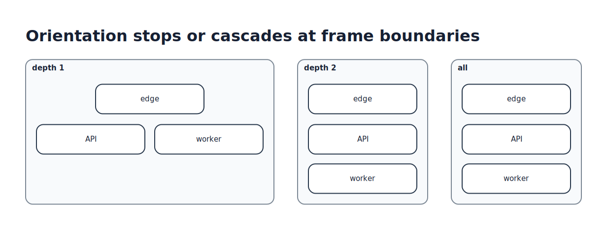

# Layout and orientation

Kvísl layouts describe relative arrangement, never a geometric transform of their children. Every structural container owns a local directional frame. Rows, columns, sides, ports, corridors, anchors, and routes are interpreted in that frame and then mapped into the parent frame.

## Orientation remaps direction

An orientation is a clockwise quarter-turn:

```tsx
<Row id="pipeline" orientation={90}>
  <Node id="parse" />
  <Node id="validate" />
  <Node id="store" />
</Row>
```

The row becomes a physical vertical stack. Its children remain the same upright boxes: their intrinsic width and height are not exchanged, their shapes are not rotated, and their text stays upright.

[](diagrams/orientation.tsx)

All four quarter-turns are valid:

| Orientation | A local row flows physically | Local `right` maps to |
| --- | --- | --- |
| `0` | right | right |
| `90` | down | bottom |
| `180` | left | left |
| `270` | up | top |

The same mapping applies to local port sides, padding sides, corridor directions, anchor placement, and line entry or exit directions. Orientation therefore keeps a component internally consistent instead of rotating only its layout while leaving its ports behind.

## Depth controls how far the mapping cascades

The numeric form is shorthand for depth one:

```tsx
<Scope id="service" orientation={90}>…</Scope>
```

Depth one remaps the declaring container's layout and the directional attachment semantics of its direct children. It stops before changing the layout strategy of the next nested frame. This is the normal component-composition behavior: a caller can turn a component's outer flow without unexpectedly reorganizing every internal subsystem.

Use the structured form when nested layouts should participate:

```tsx
<Scope id="service" orientation={{ degrees: 90, depth: 2 }}>…</Scope>
<Scope id="service" orientation={{ degrees: 90, depth: "all" }}>…</Scope>
```

- `depth: 2` also remaps the next nested layout/frame boundary.
- A larger positive integer crosses that many normalized frame boundaries.
- `depth: "all"` reaches the complete materialized subtree.
- Omitting `depth` from the structured form still means one.
- Zero, negative, fractional, and unknown depth values are diagnostics.

[](diagrams/getting-started-orientation-depth.tsx)

Depth counts normalized structural frames. JSX fragments, arrays, helper functions, and component-function calls do not consume it. A hidden view template consumes nothing until the renderer materializes that branch into the projected object tree.

## Nested orientations compose

A descendant may declare another orientation. Active mappings compose in quarter-turns modulo 360 degrees:

```tsx
<Scope id="outer" orientation={{ degrees: 90, depth: "all" }}>
  <Row id="inner" orientation={270}>…</Row>
</Scope>
```

Where both mappings apply, `90 + 270` resolves to `0`. Each declaration remains local; moving the component beneath a differently oriented parent does not require rewriting its internal side names or layout kind.

## Orientation is not painter rotation

Layout orientation changes semantic direction only. It does not rotate child pixels, text, icons, or intrinsic dimensions. A painterly rotation of text or a shape is an independent presentation property and does not change layout axes, ports, corridors, or routing.

The solver never chooses an orientation implicitly. Automatic orientation may be added later only as an explicit opt-in; authored `0`, `90`, `180`, and `270` remain hard directional intent.

## Related reading

- [Getting started](getting-started.md#rotate-a-local-frame) introduces the syntax in a complete model.
- [Routing, corridors, and ports](routing-and-ports.md) explains how mapped sides and whitespace become routeable geometry.
- [Data model](../MODEL.md#2-frames-and-orientation) defines the conceptual frame model and IR fields.
- [Requirements](../REQUIREMENTS.md#5-orientation) defines the normative behavior.
