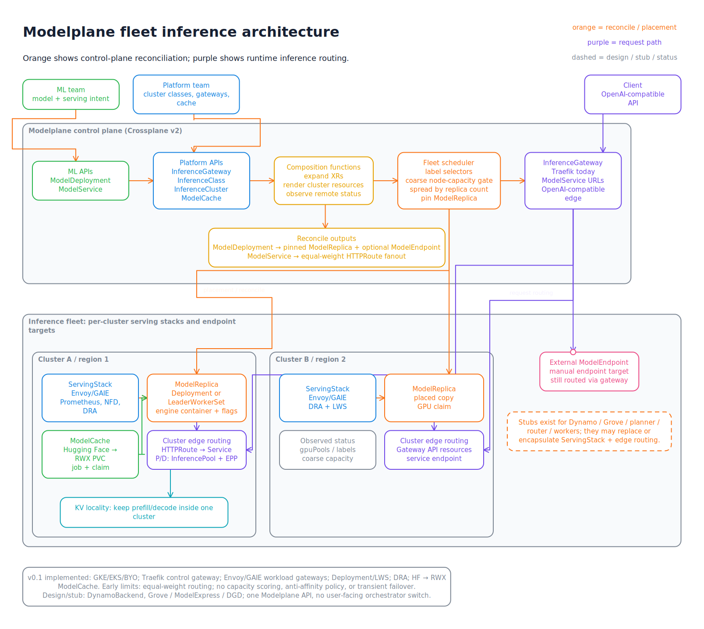

# Overview

Kvísl Script, or Kvísl for short, is a modelling language for technical design diagrams. It combines the composability of code with the visual freedom of a drawing tool, while keeping logical structure — not pixel coordinates — as the source of truth.

## The problem

Small diagrams are easy. Large, evolving diagrams are not.

A free-form canvas lets an author draw almost anything, but every structural change creates manual layout and routing work. Traditional diagram languages automate layout, but commonly flatten the problem into one graph or support only a fixed family of diagram types. Both approaches become awkward when a drawing contains reusable subsystems, nested boundaries, long cross-hierarchy connections, different levels of detail, and page-sized routing structure.

Kvísl is designed for drawings that may begin as five boxes and grow into a DIN A0 architecture poster or an effectively unbounded model of a complete Kubernetes or Linux system.

## The model in one example

```tsx
const request = port<Request>();

function Service({ id, request }: {
  id: string;
  request: PortHandle<Request>;
}) {
  return (
    <Scope id={id} role="service">
      <Node id="api">
        <Text>API</Text>
        <Port id="request" side="left" bind={request} />
      </Node>
    </Scope>
  );
}

export default (
  <Diagram id="checkout">
    <Row id="system" gap="large">
      <Node id="client">
        <Text>Client</Text>
        <Port id="request" side="right" />
      </Node>
      <Service id="orders" request={request} />
    </Row>

    <Line from="system/client.request" to={request} label="place order" />
  </Diagram>
);
```

The source says that two objects belong in a row, that the service exposes a request port, and that a line connects the client to that port. It does not say where either object sits, where the line bends, or how much space its label occupies. Those are solver decisions constrained by the logical model.

The component caller knows the public port handle but not the service's internal path. The service may later gain several nested objects or a different rendered view without changing the caller.

## The mental model

Kvísl has a small core rather than a catalogue of diagram types.

### Objects and containment

There is one structural object model. An object may have a shape, content, ports, children, a boundary, a layout, and a local orientation. `Diagram`, `Scope`, and `Node` are authoring forms with different defaults over that model, not unrelated primitives.

Every author-declared container has a local ID. IDs are resolved relative to containment, so two instances of the same component can contain the same internal IDs without collision.

### Components and ports

Components are ordinary TypeScript functions. A component exposes opaque port handles as its public connection surface. Callers can treat it as a black box, while intentional deep paths remain possible for cases that genuinely need them.

Ports are symmetric attachment points. Direction belongs to line heads, not to a separate input/output port type. Several lines attached to the same named port form one topological join and may merge, bundle, or split according to the port's sharing policy.

### Layout without authored positions

Rows, columns, grids, overlays, layered layouts, and constraints express relative arrangement. Source order is normally a soft preference: it guides the solver but does not force a poor result unless the author marks it fixed.

Every container has a local frame that can be rotated by `0`, `90`, `180`, or `270` degrees. A component can therefore be embedded in another flow direction without rewriting its internals.

[](diagrams/orientation.tsx)

### Lines made of logical segments

A line has two symmetric ends and an ordered sequence of segments. Most segments are implicit. The normalizer infers hierarchy exits, entries, and connective runs. An author adds an explicit segment only to state something meaningful, such as:

- pass through the gap between two subsystems;
- use a container's left padding band;
- visit a decision object;
- place a label on that particular run.

Lines may cross any number of containment boundaries. They do not have to enumerate each ancestor they traverse.

### Whitespace is part of the model

The gaps between layout siblings and the padding inside containers form the routing plane. A line routed through that whitespace reserves space, and layout reacts to the route. A named corridor refines an existing gap or padding band with capacity, track spacing, ordering, packing pressure, or a visible divider.

[](diagrams/routing-corridors.tsx)

This makes a route such as “leave this subsystem vertically, travel across the higher-level gap, and enter that subsystem from below” a structural request rather than a list of bends.

### Presentation through rules

Objects and lines carry semantic roles and classes. Typed rules provide presentation through a fixed cascade:

```text
renderer default < theme < library < document < inline style
```

This lets a UML library define notation, a theme define a visual language, and a document override either without copying styles into every component. Rules may affect presentation and metric defaults, but never topology or object existence. Named tokens — the custom-property analog — resolve through the same layers, so a document can swap a theme's palette or spacing scale without touching any rule.

[](../examples/modelplane-fleet-inference/neon-infrastructure.tsx)

### Views and adaptive detail

A component may own several hidden render views. Views preserve the component's identity and canonical ports while providing different internal templates.

View selection uses media-query-like first-fit semantics. The renderer evaluates views in declaration order and materializes the first one whose condition, footprint, and active policy are viable. An outside-in `maximum-that-fits` policy can therefore choose a detailed view on a large canvas and a compact view on a constrained page.

<table>
  <tr><th>Wide allocation</th><th>Narrow allocation</th></tr>
  <tr>
    <td><a href="diagrams/adaptive-service.tsx"></a></td>
    <td><a href="diagrams/adaptive-service.tsx"></a></td>
  </tr>
</table>

Unselected view branches are not visible to ordinary paths. Stable component ports remain the normal way to connect across changing views.

## From source to drawing

The pipeline keeps authoring, selection, geometry, and painting separate:

```text
TSX source
  -> component expansion and normalization
  -> Logical IR
  -> renderer context and view materialization
  -> Projection IR
  -> layout and routing
  -> Solved IR
  -> SVG, Excalidraw, Canvas, or another target
```

[](diagrams/render-pipeline.tsx)

TSX is evaluated once. Go, Rust, and TypeScript consumers operate on versioned, language-neutral intermediate representations rather than re-running author code.

## Visual ambition

A single model can contain nested scopes, repeated components, long hierarchy-crossing routes, routing buses, merged trunks, conditional detail, annotations, dividers, images, and multiple visual roles.

[](../examples/modelplane-fleet-inference/diagram.tsx)

The linked source formulates this Modelplane architecture without authored pixel positions. See the [example index](../examples/README.md) for more complete models.

## Who is this for?

Kvísl is primarily for agents tasked with building awesome, visually brilliant architecture sketches. The logical model gives an agent enough structure to compose large drawings, route connections intentionally, choose suitable detail, and regenerate the result without maintaining pixel coordinates.

It is especially useful for agents working on behalf of:

- architects documenting systems that outgrow a single slide;
- platform and infrastructure teams describing nested environments and control paths;
- library authors defining reusable notation or domain components;
- engineers who want several projections of one model without duplicating diagrams;
- teams that want editable Excalidraw output and deterministic SVG from the same source.

It is probably unnecessary for a disposable sketch, a small flowchart, or a drawing whose exact hand-placed composition is the primary artifact.

## Does the world need this?

That is the question this documentation exists to answer before the prototype becomes a production toolchain. The design bets on three things no existing tool combines:

1. **Components with ports instead of global IDs** — reusable, nestable, rotatable subsystems whose callers never see internal names;
2. **Whitespace routing** — corridors, shared trunks, and hierarchy-crossing routes as logical structure instead of hand-maintained polylines;
3. **Editable output with stable identity** — regenerate into an existing Excalidraw document and it updates instead of clobbering manual adjustments.

If you draw or generate technical diagrams, we would like to know:

- Which of the three bets matters to you — and which is solved well enough today by Mermaid, D2, Structurizr, PlantUML, or a hand-drawn canvas?
- Have you abandoned a large diagram because maintaining it became too expensive? What exactly broke?
- Would you author in TSX, or is a non-code surface a requirement?
- Is the adaptive-views idea (one model, A4 summary to A0 detail) valuable or over-engineering?
- Would agents generating diagrams on your behalf change what you need from the format?

Feedback is most useful against a concrete artifact: read one [reference model](../examples/README.md) next to [its target drawing](../examples/modelplane-fleet-inference/original.png) and judge whether the source earns its keep.

## Continue

- Follow the [getting started guide](getting-started.md) to create and render a model.
- See [routing, corridors, and ports](routing-and-ports.md) for illustrated routing semantics.
- Read [UML with Kvísl Script](uml.md) to see how a substantial notation composes over the core.
- Consult the [requirements](../REQUIREMENTS.md) and [data model](../MODEL.md) for normative detail.
