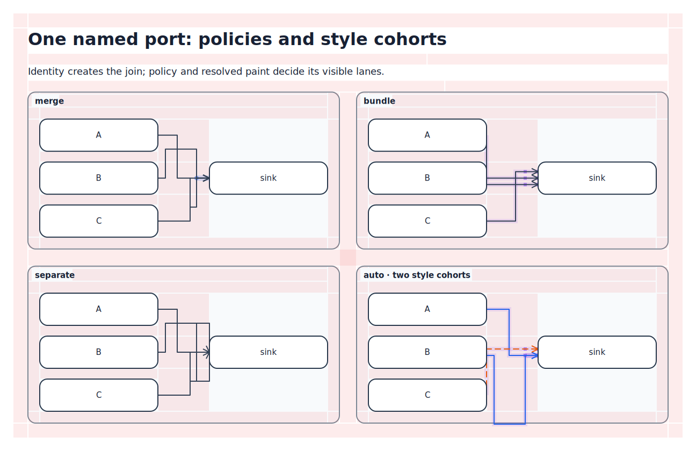
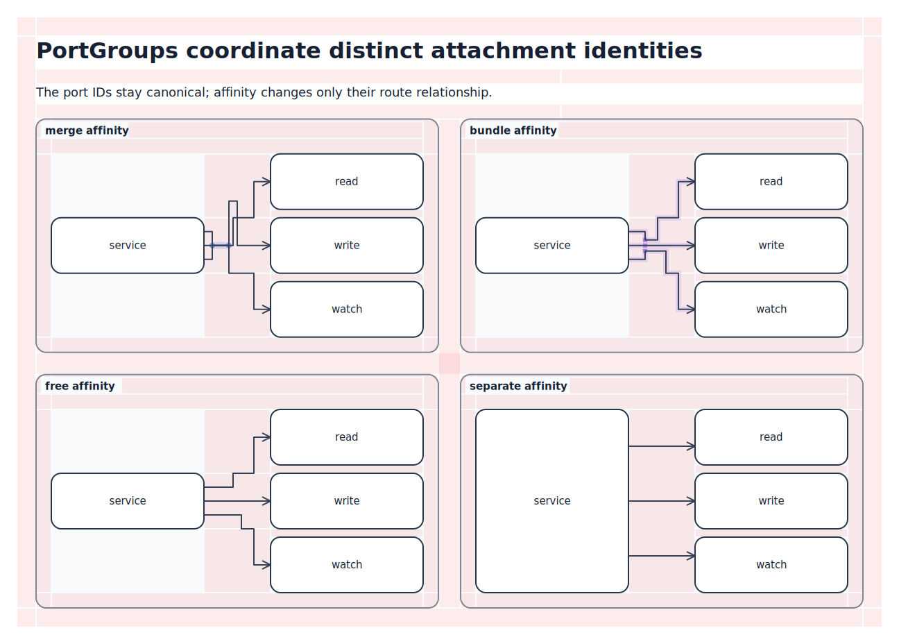

# Routing, corridors, and ports

Kvísl treats routing as part of the logical model, but not as authored geometry. Authors name meaningful attachment identities and route regions; the solver chooses concrete portals, tracks, bends, and dock positions.

The illustrations on this page show how logical attachment and routing instructions map to solved geometry.

## Hierarchy-crossing lines

A line may connect objects at any depth. The normalizer finds their least common ancestor and creates the implicit hierarchy traversal. An author does not enumerate every boundary the line exits or enters.

[](diagrams/routing-corridors.tsx)

The corresponding source identifies only the endpoints and the meaningful middle region:

```tsx
<Line
  from="source/producer.out"
  to="target/consumer.in"
>
  <Segment
    through={padding(self, "top")}
    label="request bus"
  />
</Line>
```

The line consists of several logical segments:

- an inferred exit from the source object and its containing subsystem;
- an explicit segment through the parent padding band, carrying the label;
- an inferred entry through the target subsystem to its dock.

Each segment may have its own label and style. Explicit segments constrain regions, not pixel coordinates.

## Gaps, padding bands, and corridors

Whitespace created by layout is routable structure:

- `gap(a, b)` identifies the whitespace between layout siblings;
- `padding(container, side)` identifies one inner boundary band of a container;
- `padding(self, side)` addresses the declaring component's own root band;
- a named corridor refines one of those implicit regions.

Several corridor refinements may occupy the same structural region. Their rank supplies the order within it. A normalized corridor carries the region, axis, minimum and preferred track spacing, pressure, capacity, divider, track-order constraints, and allowed sharing modes.

[](diagrams/routing-corridors.tsx)

The translucent red debug cells come from the router's canonical channel mesh. They expose padding bands, sibling gaps, intersections, and the ordered refinements within the central gap. The route tracks and their bundles are centered within those exact regions.

A divider is decoration on the gap itself — a visible boundary line between two bands never requires a fake boundary element.

Pressure is a packing preference, not permission to violate spacing. A high-pressure corridor encourages narrow track packing and permitted sharing while preserving hard minimums.

## Named ports create joins

A named port has canonical identity `(owner object, local port ID)`. Every line end attached to that identity participates in one topological join. Cardinality controls whether multiple attachments are allowed; the independent sharing policy controls the geometry next to the join.

| Solved drawing | Sharing debug |
| --- | --- |
| [](diagrams/port-sharing.tsx) | [](diagrams/port-sharing.tsx) |

```tsx
<Port
  id="events"
  side="left"
  cardinality="many"
  sharing={{
    mode: "merge",
    branch: { preference: "late" },
  }}
/>
```

The policies mean:

- `merge` requires a single positive-length trunk;
- `bundle` retains separate strokes but routes them closely together;
- `separate` allows only the common semantic dock and splits positive-length geometry immediately;
- `auto` lets the router choose according to space, style compatibility, and corridor pressure.

Sharing is symmetric. The same rules apply to fan-in and fan-out.

Different visible stroke styles cannot occupy the same positive-length centerline. When sharing permits a fallback, incompatible styles become close parallel bundle lanes; a required incompatible merge is a diagnostic. Compatible members may still merge within one style cohort.

Once a line joins a bundle on the way to its common end, it stays in that bundle. Membership grows monotonically toward the canonical port, port-group terminal, or explicit common end, and lane order cannot swap inside the bundle. The terminal approach remains bundled: every visible lane keeps a collision-free final run, arrowhead, and physical dock slot. Several slots below one named port remain one semantic port and are packed more closely than unrelated docks.

Several `separate` lines on one named port also receive collision-free physical approach slots when one coincident point would overlap their final strokes or arrowheads. Those slots use wider independent spacing, preserve a crossing-minimizing terminal order, and authorize no shared positive-length run. They do not create additional named ports.

## Port groups are not named-port joins

A `PortGroup` coordinates several distinct ports owned by one object. It is unnecessary when several lines already use the same named port.

```tsx
<Node id="store">
  <PortGroup id="operations">
    <Port id="read" side="left" />
    <Port id="write" side="left" />
    <Port id="watch" side="left" />
  </PortGroup>
</Node>
```

The ports remain canonically `store.read`, `store.write`, and `store.watch`; the group does not add itself to their paths. It contributes adjacency, ordering, affinity, and an optional branch policy across those distinct attachment identities.

Group affinity may be:

- `merge` — coordinate the attached lines into a common share group;
- `bundle` — keep their routes parallel and close;
- `free` — impose no geometric relationship;
- `separate` — keep the routes visibly apart.

| Solved drawing | Sharing debug |
| --- | --- |
| [](diagrams/port-groups.tsx) | [](diagrams/port-groups.tsx) |

The debug overlay is derived from the same solved share-group state consumed by track allocation, routing, and quality checks. Blue points mark merge trunks; purple lane overlays, terminal slots, and branch pins expose bundle continuity. `free` and `separate` remain uncoalesced and therefore do not acquire a synthetic shared trunk.

## Object-only endpoints own private docks

A line may name an object without naming a port:

```tsx
<Line id="health" from="monitor" to="service" />
<Line id="metrics" from="collector" to="service" />
```

Each target receives a private dock derived from the line identity and end index. The router chooses a suitable point on `service`, but the two lines do not join even if those points coincide geometrically.

This distinction keeps convenient automatic attachment from silently creating topology. Use a named port when identity or joining matters; use an object-only endpoint when it does not.

## Dock presentation composes with line presentation

A dock and its line may both contribute style. The effective dock retains properties supplied only by the dock and gains dock-applicable properties from the line. If both specify the same property, the line wins. Named-port and line-owned docks follow the same cascade.

## Branch placement

Shared paths are maximal by default: lines merge as early as possible when travelling away from separate ends and split as late as possible when approaching them. A `BranchPolicy` selects `late`, `early`, or `balanced` and may carry a `within` region. The region constrains where branching may occur without selecting an exact point inside it.

## What remains a solver decision

The logical model deliberately leaves these choices open:

- which exact boundary portal a hierarchy traversal uses;
- track coordinates and bends inside a corridor;
- a line-owned dock's perimeter position;
- the exact branch point inside an allowed region;
- whether `auto` sharing merges or bundles;
- how competing soft ordering and spacing preferences trade off.

The resulting Solved IR records those choices together with provenance back to the logical lines, segments, ports, and regions.
