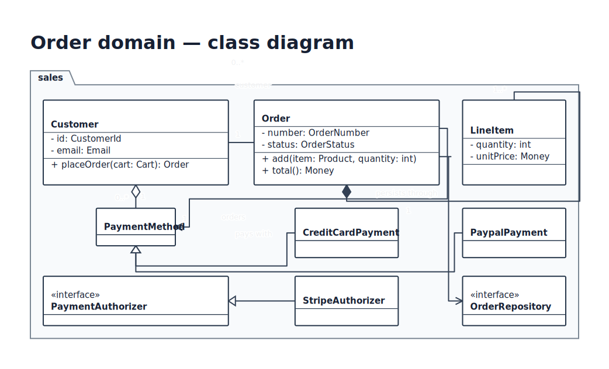
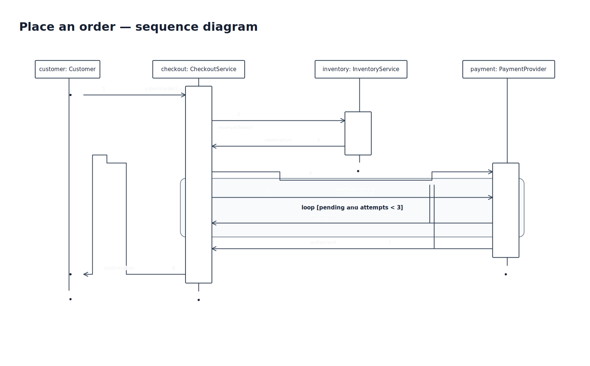
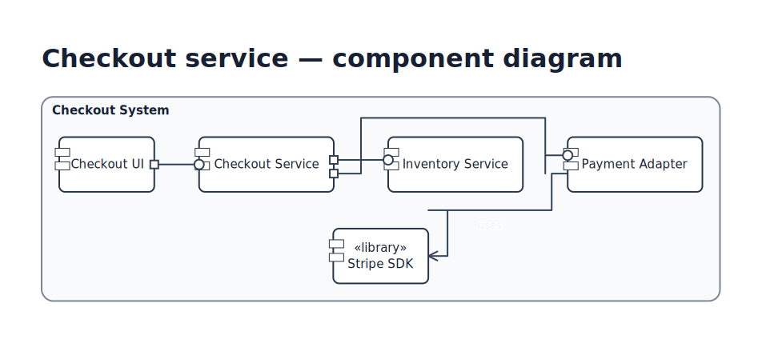
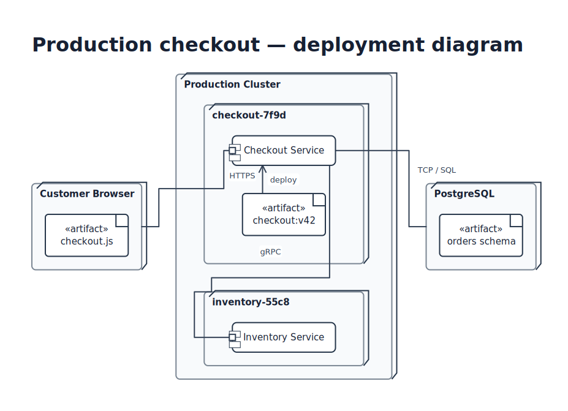
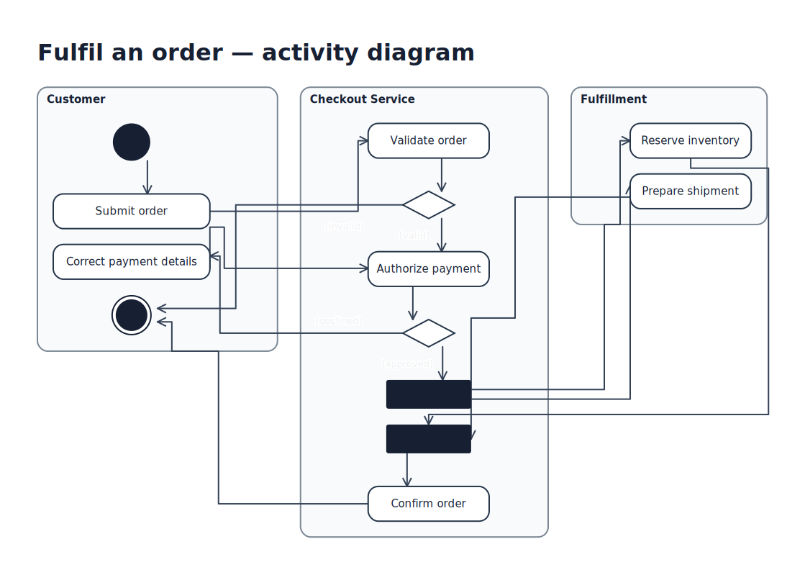
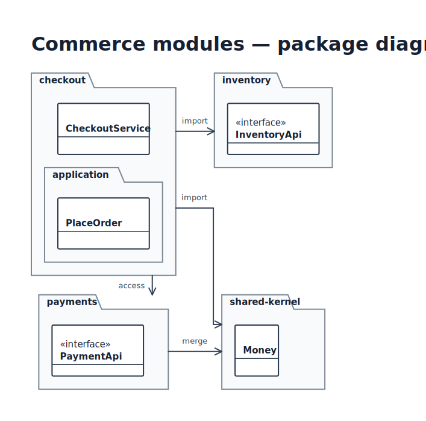
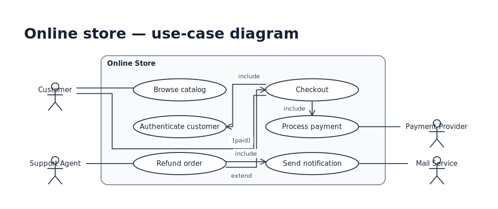
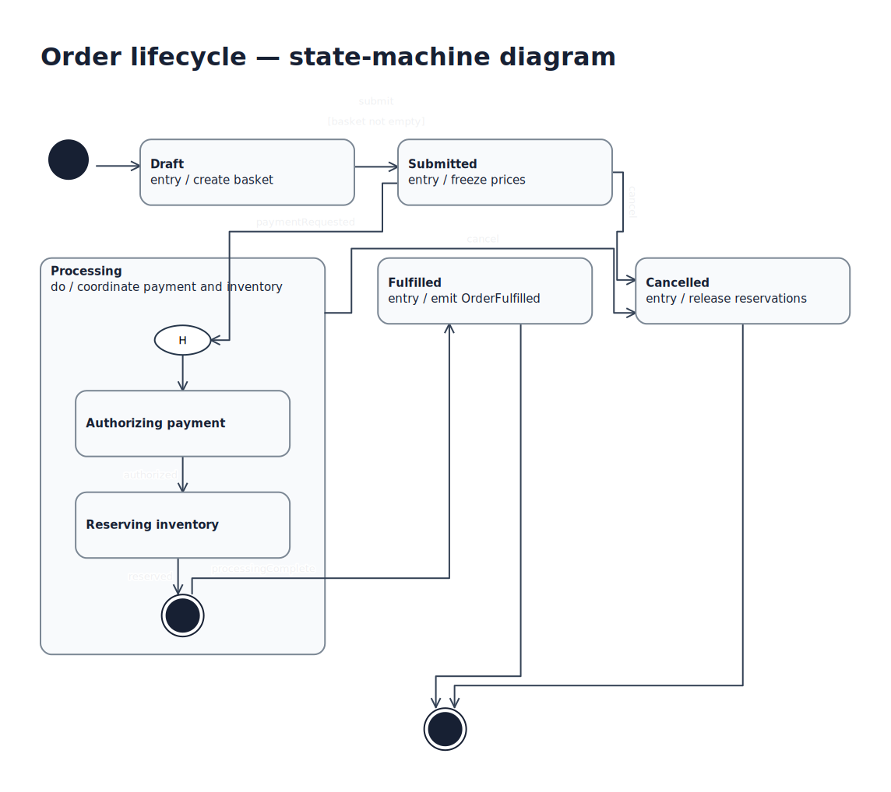

# UML with Kvísl Script

UML is a Kvísl library, not a separate renderer or a privileged branch of the core model. UML components expand into the same objects, layouts, ports, lines, constraints, subjects, styles, and paint relations used by architecture diagrams.

This keeps UML composable with non-UML content. A deployment node may contain ordinary infrastructure components; a component diagram may connect to a detailed service model; several diagrams may depict the same semantic subject.

The examples on this page use the library in [`examples/uml/uml.tsx`](../examples/uml/uml.tsx).

## Render a UML diagram

```console
$ kvisl render examples/uml/class-diagram.tsx \
    --output order-domain.excalidraw
```

The result is an editable Excalidraw document. The same source can target SVG or another painter without changing UML semantics.

## Class diagrams

[](../examples/uml/class-diagram.tsx)

A class is an ordinary object with a rectangle primitive and structured content groups:

```tsx
<UmlClass
  id="order"
  name="Order"
  subject={{ namespace: "uml", id: "sales/Order" }}
  attributes={[
    { visibility: "-", text: "number: OrderNumber" },
    { visibility: "-", text: "status: OrderStatus" },
  ]}
  operations={[
    { visibility: "+", text: "add(item: Product, quantity: int)" },
    { visibility: "+", text: "total(): Money" },
  ]}
  ports={[
    { id: "customer", side: "left" },
    { id: "items", side: "bottom" },
    { id: "payment", side: "right" },
  ]}
/>
```

`UmlClass` expands to a rectangular object containing a class-name entry and `attributes` and `operations` content groups. A UML stylesheet derives compartment dividers, typography, and notation from those roles. The core stores the content groups without knowing what a UML class is.

### Associations and adorned ends

UML associations use the core line model with two structured ends:

```tsx
<UmlAssociation id="order-items">
  <UmlEnd
    ref="model/order.items"
    aggregation="composite"
    multiplicity="1"
  />
  <UmlEnd
    ref="model/line-item.order"
    multiplicity="1..*"
  />
</UmlAssociation>
```

The library lowers this to one `LineIR`:

- the filled diamond becomes the head on one endpoint;
- multiplicities remain distinct endpoint labels near their docks;
- an association name becomes a label on a prominent segment;
- navigability becomes the corresponding endpoint head;
- any explicitly pinned middle segments remain ordinary line segments.

Roles, multiplicities, relation names, and guards are not concatenated into one display string. They remain independently placeable `LabelIR` values.

### Shared generalization trunks

Several generalizations can attach to the same named port on a superclass. The canonical port join and its sharing policy create one hollow-triangle trunk:

```tsx
<Port
  ref="model/payment-method.generalizations"
  side="bottom"
  sharing={{
    mode: "merge",
    branch: { preference: "late" },
  }}
/>

<UmlRelation
  id="credit-card-generalization"
  kind="generalization"
  from="model/credit-card"
  to="model/payment-method.generalizations"
/>

<UmlRelation
  id="paypal-generalization"
  kind="generalization"
  from="model/paypal"
  to="model/payment-method.generalizations"
/>
```

This is not special inheritance routing. It is the same named-port join and merged path used elsewhere in Kvísl, with a UML head supplied by the library.

[](../examples/uml/class-diagram.tsx)

## Sequence diagrams

[](../examples/uml/sequence-diagram.tsx)

Sequence diagrams need a higher-level component because time is an authoring concept, not a core axis. Inside `Interaction`, JSX source order defines temporal order:

```tsx
<Interaction id="checkout-flow">
  <Lifeline
    id="customer"
    name="customer"
    classifier="Customer"
    subject={{ namespace: "uml", id: "sales/Customer" }}
  />
  <Lifeline
    id="checkout"
    name="checkout"
    classifier="CheckoutService"
    activations={[
      { id: "handling", from: "submit", to: "confirmation" },
    ]}
  />
  <Lifeline id="inventory" name="inventory" classifier="InventoryService" />
  <Lifeline id="payment" name="payment" classifier="PaymentProvider" />

  <Message id="submit" from="customer" to="checkout" call="submit(order)" />
  <Message id="reserve" from="checkout" to="inventory" call="reserve(items)" />
  <Reply id="reserved" from="inventory" to="checkout" value="reservation" />

  <Loop id="payment-retry" guard="pending and attempts &lt; 3">
    <Message id="poll" from="checkout" to="payment" call="status()" />
    <Reply id="pending" from="payment" to="checkout" value="pending" />
  </Loop>

  <Reply id="confirmation" from="checkout" to="customer" value="confirmation" />
</Interaction>
```

`Interaction` consumes its typed child declarations and expands them before normalization:

- each lifeline becomes an object with a head, occurrence objects, an end, and a dashed spine line;
- each message becomes a line between corresponding occurrences;
- an alignment constraint places the two occurrences on one message row;
- hard spatial-order constraints preserve temporal source order;
- an activation becomes an object under an `extent` constraint between two occurrences;
- a combined fragment becomes a frame object plus an `inside` constraint over its occurrences.

[](../examples/uml/sequence-diagram.tsx)

There is no `SequenceDiagramIR`, time coordinate, activation primitive, or fragment primitive in the core.

## Shared subjects across diagrams

An optional `SubjectRef` identifies what an object depicts independently of the diagram that depicts it:

```tsx
const orderSubject = {
  namespace: "uml",
  id: "sales/Order",
};

<UmlClass id="order" name="Order" subject={orderSubject} />
<Lifeline id="order" name="order" classifier="Order" subject={orderSubject} />
```

The core stores and round-trips the opaque pair. A UML library or modelling tool may use it for navigation, consistency checks, or a subject catalogue. The normalizer does not interpret it.

## Styling UML

The UML library expresses notation through library-layer rules keyed by semantic roles:

```tsx
export const umlStyles = [
  rule(role("uml-dependency"), { dash: "dashed" }),
  rule(role("uml-realization"), { dash: "dashed" }),
  rule(role("uml-reply"), { dash: "dashed" }),
  rule(role("uml-lifeline-spine"), { dash: "dashed" }),
  rule(role("uml-activation"), { fill: "near-white" }),
];
```

Theme rules can set the overall visual language, and document rules or inline styles can override library presentation. The UML components keep their topology and semantic roles unchanged.

## Supported diagram families

The example library covers the principal structural and behavioral families:

| UML family | Library vocabulary | Core mechanisms after expansion |
| --- | --- | --- |
| Class | `UmlClass`, `UmlAssociation`, `UmlRelation` | objects, content groups, ports, structured line ends, labels |
| Object | `UmlObject` | objects and slot content groups |
| Component | `UmlComponent` | extension shapes, named ports, relations |
| Deployment | `UmlDeploymentNode`, `UmlArtifact` | nested objects, subjects, dependencies |
| Package | `UmlPackage` | shaped container objects and nested layouts |
| Use case | `UmlActor`, `UmlUseCase` | extension shapes, ellipses, relations |
| Sequence | `Interaction`, `Lifeline`, `Message`, `Reply`, `Loop` | objects, lines, align/order/extent/inside constraints |
| Activity | `UmlAction`, `UmlActivityPartition`, pseudostates | nested objects, control-flow lines, decisions, forks and joins |
| State machine | `UmlState`, pseudostates, transitions | nested shaped objects, guards, hierarchy-crossing lines |

See the [complete UML example index](../examples/uml/README.md) and its individual TSX models.

<table>
  <tr><th>Component</th><th>Deployment</th><th>Activity</th></tr>
  <tr>
    <td><a href="../examples/uml/component-diagram.tsx"></a></td>
    <td><a href="../examples/uml/deployment-diagram.tsx"></a></td>
    <td><a href="../examples/uml/activity-diagram.tsx"></a></td>
  </tr>
  <tr><th>Package</th><th>Use case</th><th>State machine</th></tr>
  <tr>
    <td><a href="../examples/uml/package-diagram.tsx"></a></td>
    <td><a href="../examples/uml/use-case-diagram.tsx"></a></td>
    <td><a href="../examples/uml/state-machine-diagram.tsx"></a></td>
  </tr>
</table>

## Core versus library responsibility

The division is deliberate:

| Core owns | UML library owns |
| --- | --- |
| containment and local IDs | UML component names and convenience props |
| layouts and spatial constraints | compartment and stereotype conventions |
| ports, docks, joining, and sharing | UML endpoint adornments and relation kinds |
| segmented lines and labels | interaction source-order semantics |
| subject references | UML subject catalogues and metamodel validation |
| style-rule cascade | UML notation roles and library rules |
| Projection and Solved IR | expansion from UML declarations to core entities |

This boundary lets another notation library reuse the same renderer and solver without inheriting UML concepts, and lets one drawing mix UML with ordinary architecture components.

## Use core constructs when needed

UML components are conveniences, not closed syntax. A model may place an ordinary `Node` inside a deployment node, route a normal line through a UML package, add a corridor between activity partitions, or constrain a UML frame with the same relations used elsewhere.

The normalized result remains one coherent Kvísl model.
